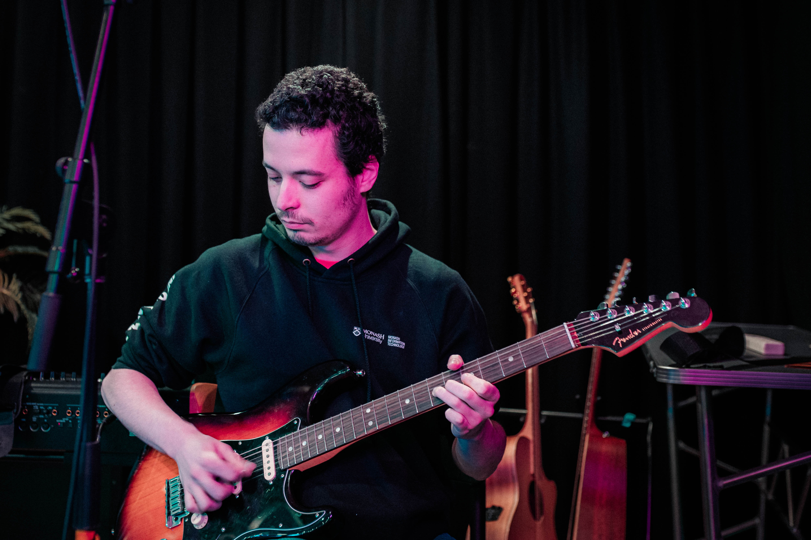

# Background
I've been programming and learning about computing since the age of 15, and I've been playing with [Swift](https://www.swift.org), JavaScript/[TypeScript](https://typescriptlang.org), Java/[Kotlin](https://kotlinlang.org), C/C++, [Python](https://python.org), and nowadays I focus on [Go](https://go.dev). In addition, I am enthusiastic about open-source software (mainly in the Linux ecosystem), and maintain several personal projects on [GitHub](https://github.com/AppleGamer22). In my personal projects, I like to use modern tools such as [Docker](https://www.docker.com), [Buf](https://buf.build), [GoReleaser](https://goreleaser.com), [GitHub Actions](https://github.com/features/actions), [Nix](https://nixos.org), [Terraform](https://www.terraform.io), and [Vagrant](https://www.vagrantup.com), as well as modern practices such as [CI/CD](/tags/ci/cd/).

## Experience
At the moment I'm studying a bachelor's degree in computer science. So far, I have some experience as source code [contributor](https://github.com/AppleGamer22/FIT2082) in a research project, and I've been a committee member in the Monash Cyber Security Club (colloquially known as [MonSec](https://monsec.io/team/)), while fulfilling the roles of general representative, secretary, vice president and president from 2021 to 2023. In addition, I have recently been assisting my friends at [Radio Monash](https://www.radiomonash.online) in software deployments and server migrations of their digital infrastructure.

# Hobbies
In my spare time, I like to play the guitar and learn genres such as rock and blues.


