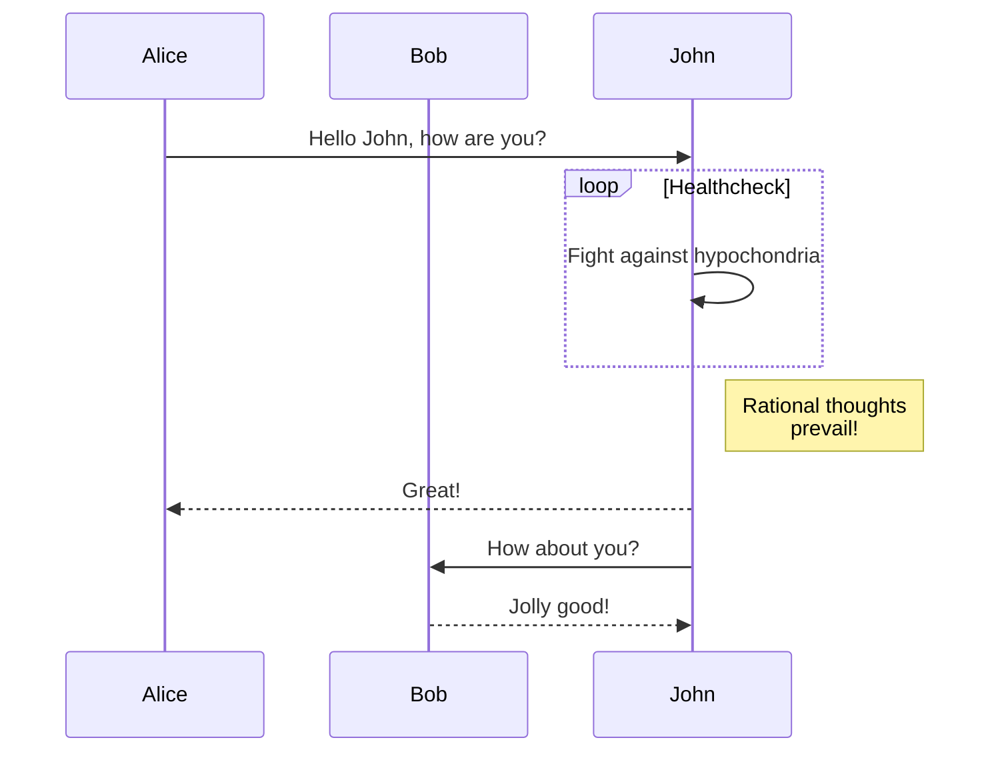

This document summarises how I set-up this website's layout, fonts and typesetting. As a result, I highly recommend the [Congo](https://github.com/jpanther/congo) theme for the [Hugo](http://gohugo.io) static site generator due to its layout, styling and extensibility.

# Additions to Congo
I added some features because I'm not pleased with how [Hugo's Shortcode syntax](https://gohugo.io/content-management/shortcodes/) prevents some content from being rendered correctly on external Markdown platforms such as [GitHub](https://github.com) and [GitLab](https://gitlab.com).

## KaTeX
The following `layouts/partials/extend-head.html` code is based [this comment](https://github.com/jpanther/congo/discussions/23#discussioncomment-1550774) from the Congo Theme discussion board, and [this file](https://github.com/jpanther/congo/blob/stable/layouts/partials/vendor.html) from Congo Theme's codebase.

```html
{{$katexCSS := resources.Get "lib/katex/katex.min.css"}}
{{$katexCSS := $katexCSS | resources.Fingerprint "sha512"}}
<link type="text/css" rel="stylesheet" href="{{$katexCSS.RelPermalink}}" integrity="{{$katexCSS.Data.Integrity}}">
{{$katexJS := resources.Get "lib/katex/katex.min.js"}}
{{$katexJS := $katexJS | resources.Fingerprint "sha512"}}
<script defer src="{{$katexJS.RelPermalink}}" integrity="{{$katexJS.Data.Integrity}}"></script>
{{$katexRenderJS := resources.Get "lib/katex/auto-render.min.js"}}
{{$katexRenderJS := $katexRenderJS | resources.Fingerprint "sha512"}}
<script defer src="{{$katexRenderJS.RelPermalink}}" integrity="{{$katexRenderJS.Data.Integrity}}"></script>
{{ $katexFonts := resources.Match "lib/katex/fonts/*" }}
{{ range $katexFonts }}
	<!-- {{ .RelPermalink }} -->
{{ end }}
<script>
	document.addEventListener("DOMContentLoaded", () => {
		renderMathInElement(document.body, {
			delimiters: [
				{
					left: '$$',
					right: '$$',
					display: true
				},
				{
					left: '$',
					right: '$',
					display: false
				},
			],
			throwOnError: false
		});
	});
</script>
```

This change makes the KaTeX CSS and JavaScript files to load by default, and it also enables the single `$` delimiter to be used with less future configuration.

### Result
With these configurations added, graphically-complex inline math expressions such as the following can be rendered:

* A second order polynomial euqation can be solved with the formula $\displaystyle x = \frac{-b \pm \sqrt{b^2 -  4ac}}{2a}$ for a quadratic equation of the form $ax^2 + bx + c = 0$, for all $a \neq 0$.
* On a spherical surface, the area of a triangle with angles $\alpha$, $\beta$ and $\gamma$ (all measured in radians) is described by the formula $A_t = r^2(\alpha + \beta + \gamma - \pi)$, when $r$ is the radius of the sphere.
* [Binet's Formula](https://en.wikipedia.org/wiki/Fibonacci_number#Relation_to_the_golden_ratio) for calculating arbitrary Fibonacci numbers states that $\displaystyle F_n = \frac{\phi^n - (-\phi)^{-n}}{\sqrt{5}}$, when $\displaystyle \phi = \frac{1 + \sqrt{5}}{2}$.
* The integral of a polynomial of degree $n \neq -1$ can be calculated by the formula $\displaystyle \int x^n dx = \frac{x^{n + 1}}{n + 1} + C$

In addition, blocks of multi-line mathematical expressions can be rendered:

$$
\begin{align*}
	x &= \frac{1}{x - 1} & \text{definition of } \phi \\\
	x(x - 1) &= 1 & \times (x - 1) \\\
	x^2 - x &= 1 & a(b \pm c) = ab \pm ac \\\
	x^2 - x - 1 &= 0 & -1 \\\
	x &= \frac{-(-1) \pm \sqrt{(-1)^2 - 4 \cdot (-1)}}{2}
	& \text{using } x = \frac{-b \pm \sqrt{b^2 - 4ac}}{2a} \\\
	&& \text{when } ax^2 + bx +c = 0 \wedge a \neq 0 \\\
	&= \frac{1 \pm \sqrt{1 + 4}}{2} & \text{simplification} \\\
	&= \frac{1 \pm \sqrt{5}}{2} & \text{simplification}
\end{align*}
$$

Due to Hugo's use of the `\` character for text escaping, the sequence `\\\` is required instead of `\\` (at the source-code level) in order to correctly render a line break. Moreover, the `align*` environment seems to be the most compatible between KaTeX and MathJax. This change does not seem to affect $\TeX$ rendering in other platforms.

## Technical Diagrams
The following `layouts/partials/extend-head.html` code is based on [Docsy's diagram support](https://www.docsy.dev/docs/adding-content/diagrams-and-formulae/#diagrams-with-mermaid), and implemented similarly to [Docsy's implementation](https://github.com/google/docsy/blob/main/assets/js/mermaid.js), and [Congo's implementation](https://github.com/jpanther/congo/blob/stable/assets/js/mermaid.js), the theme settings are based on [Mermaid's documentation](https://mermaid-js.github.io/mermaid/#/theming).

```html
{{$mermaidLib := resources.Get "lib/mermaid/mermaid.min.js"}}
{{$mermaidConfig := resources.Get "js/mermaid.js"}}
{{$mermaidConfig := $mermaidConfig | resources.Minify}}
{{$mermaidJS := slice $mermaidLib $mermaidConfig | resources.Concat "js/mermaid.bundle.js" | resources.Fingerprint "sha512"}}
<script defer type="text/javascript" src="{{$mermaidJS.RelPermalink}}" integrity="{{$mermaidJS.Data.Integrity}}"></script>

<script>
	/**
	 * @type {string} color an RGB tuple that represents a colour in CSS
	 * @returns an RGB CSS function form of the variable
	*/
	function tuple2RGB(color) {
		return `rgb(${getComputedStyle(document.documentElement).getPropertyValue(color)})`;
	}
	/** @returns text colour appropriate for colour theme */
	function textColor() {
		switch (document.documentElement.classList.contains("dark")) {
		case true:
			return "white";
		case false:
			return "black";
		}
	}
	document.addEventListener("DOMContentLoaded", () => {
		for (const diagram of document.querySelectorAll("code.language-mermaid")) {
			const text = diagram.textContent;
			const pre = document.createElement("pre");
			pre.classList.add("mermaid");
			pre.textContent = text;
			diagram.parentElement.replaceWith(pre);
		}
		mermaid.initialize({
			theme: "base",
			themeVariables: {
				background: tuple2RGB("--color-neutral"),
				primaryColor: tuple2RGB("--color-primary-200"),
				secondaryColor: tuple2RGB("--color-secondary-200"),
				tertiaryColor: tuple2RGB("--color-neutral-100"),
				primaryBorderColor: tuple2RGB("--color-primary-400"),
				secondaryBorderColor: tuple2RGB("--color-secondary-400"),
				tertiaryBorderColor: tuple2RGB("--color-neutral-400"),
				lineColor: tuple2RGB("--color-neutral-600"),
				textColor: textColor(),
				loopTextColor: textColor(),
				primaryTextColor: "black",
				fontFamily: "ui-sans-serif,system-ui,-apple-system,BlinkMacSystemFont,segoe ui,Roboto,helvetica neue,Arial,noto sans,sans-serif",
				fontSize: "16px"
			}
		});
	});
</script>
```

The following CSS was added to `assets/css/custom.css`, in order to make the diagram's background colour transparent.

```css
pre.mermaid {
	background-color: transparent !important;
}
```

### Result
With these configurations added, diagrams such as the one below can be rendered:



# Changes to Congo
I was not completely satisfied with some of the styling of the default [Congo theme](https://github.com/jpanther/congo), but luckily, it supports extensive customisations.

## CSS
### Horizontal Scroll on Small-Width Screens
The following CSS was added to `assets/css/custom.css` (based on [Congo Theme's `main.css`](https://github.com/jpanther/congo/blob/stable/assets/css/compiled/main.css)) in order to (indirectly) disable horizontal scrolling in small-width screens. It turns out that the horizontal scroll is enabled to to `a` HTML tag styling that did not limit their width to the screen width.

```css
@media (max-width: 640px) {
	a {
		max-width: 100vw !important;
		word-wrap: break-word !important;
	}
}
```

In order to render multi-line [math expressions](#katex) correctly in small-width screens, the following CSS code was added to `assets/css/custom.css`:

```css
@media (max-width: 640px) {
	span.katex-display > * {
		font-size: 0.65rem !important;
	}
}
```

In order to ensure search results don't overflow the [intended width](https://github.com/jpanther/congo/blob/stable/assets/css/compiled/main.css#L2181-L2184), the maximum width is restricted accordingly.

```css
#search-results > li > a > * {
	max-width: calc(100% - 1.5rem) !important;
	word-wrap: break-word !important;
}
```

### Fixed-Width Font
The following CSS was added to `assets/css/custom.css` (based on [this Stack Overflow comment](https://stackoverflow.com/a/68522798/7148921)) in order to set [Fira Code](https://github.com/tonsky/FiraCode)/[Cascadia Code](https://github.com/microsoft/cascadia-code) (or the OS's default) as the fixed-width font, used in code snippets.

```css
@font-face {
	font-family: 'Fira Code';
	src: local('FiraCode-Regular'), url('/FiraCode-Regular.ttf') format('truetype');
}
code {
	font-family: 'Cascadia Code', 'Fira Code', monospace !important;
}
```

#### Result
Multi-character syntax tokens such as `:=`, `++`, `!=` and `<-` should be rendered in a more graphic manner.

```go
func main() {
	q := make(chan int)
	for i := 1; i < 5; i++ {
		if i != 2 {
			q <- i
		}
	}
}
```

### Backtick-less Inline Code Snippets
The following CSS was added to `assets/css/custom.css` in order to revert [Congo Theme's `main.css`](https://github.com/jpanther/congo/blob/stable/assets/css/compiled/main.css) that surrounds inline code snippets with backtick symbols.

```css
.prose :where(code):not(:where([class~="not-prose"] *))::before {
	content: unset !important;
}
.prose :where(code):not(:where([class~="not-prose"] *))::after {
	content: unset !important;
}
```

### Quote-less Block Quote
The following CSS was added to `assets/css/custom.css` in order to revert [Congo Theme's `main.css`](https://github.com/jpanther/congo/blob/stable/assets/css/compiled/main.css) that surrounds block quote with literal quotes.

```css
.prose :where(blockquote p:first-of-type):not(:where([class~="not-prose"] *))::before {
	content: unset !important;
}

.prose :where(blockquote p:last-of-type):not(:where([class~="not-prose"] *))::after {
	content: unset !important;
}
```

### Content Width
The following CSS was added to `assets/css/custom.css` in order to increase the content width. Based on [Congo Theme's `main.css`](https://github.com/jpanther/congo/blob/stable/assets/css/compiled/main.css).

```css
.max-w-7xl {
	max-width: 100rem !important;
}
.max-w-prose {
	max-width: 100ch !important;
}
```

### Colour Scheme
The following CSS was added to `assets/css/schemes/fruit.css` (based on Congo's [`congo.css`](https://github.com/jpanther/congo/blob/stable/assets/css/schemes/congo.css) and [`fire.css`](https://github.com/jpanther/congo/blob/stable/assets/css/schemes/fire.css)) change the colour scheme primary and secondary colours from violate-fuchsia to orange-red.

```css
:root {
	--color-neutral: 255, 255, 255;
	/* Gray */
	--color-neutral-50: 250, 250, 250;
	--color-neutral-100: 244, 244, 245;
	--color-neutral-200: 228, 228, 231;
	--color-neutral-300: 212, 212, 216;
	--color-neutral-400: 161, 161, 170;
	--color-neutral-500: 113, 113, 122;
	--color-neutral-600: 82, 82, 91;
	--color-neutral-700: 63, 63, 70;
	--color-neutral-800: 39, 39, 42;
	--color-neutral-900: 24, 24, 27;
	/* Orange */
	--color-primary-50: 255, 247, 237;
	--color-primary-100: 255, 237, 213;
	--color-primary-200: 254, 215, 170;
	--color-primary-300: 253, 186, 116;
	--color-primary-400: 251, 146, 60;
	--color-primary-500: 249, 115, 22;
	--color-primary-600: 234, 88, 12;
	--color-primary-700: 194, 65, 12;
	--color-primary-800: 154, 52, 18;
	--color-primary-900: 124, 45, 18;
	/* Rose */
	--color-secondary-50: 255, 241, 242;
	--color-secondary-100: 255, 228, 230;
	--color-secondary-200: 254, 205, 211;
	--color-secondary-300: 253, 164, 175;
	--color-secondary-400: 251, 113, 133;
	--color-secondary-500: 244, 63, 94;
	--color-secondary-600: 225, 29, 72;
	--color-secondary-700: 190, 18, 60;
	--color-secondary-800: 159, 18, 57;
	--color-secondary-900: 136, 19, 55;
}
```

# Configuration
## Hugo
The following YAML snippets are taken from my [`config.yml`](https://github.com/AppleGamer22/applegamer22.github.io/blob/post/congo/config.yml), and always start from the root level of the YAML tree.

### Dependencies
I import the Congo library using [Hugo Modules](https://gohugo.io/hugo-modules/).

```yaml
module:
  imports:
    - path: github.com/jpanther/congo/v2
```

### Markup
* Syntax highlighting is configured to enable the copy button.
* The table of contents renders every heading in order.

```yaml
markup:
  highlight:
    noClasses: false
  tableOfContents:
    startLevel: 1
    endLevel: 6
```

### Privacy
All supported social media integrations are disabled for [privacy](https://gohugo.io/about/hugo-and-gdpr/) purposes.

```yaml
privacy:
  disqus:
    disable: true
  googleAnalytics:
    disable: true
  youtube:
    disable: true
  instagram:
    disable: true
  twitter:
    disable: true
  vimeo:
    disable: true
```

### Other
* I set the base URL for GitHub Pages compatibility.
* I set the timezone, in order to prevent pages with "future" dates from not rendering immediately.
* Hugo outputs are configured in order to enable content search.


```yaml
baseURL: https://applegamer22.github.io
timeZone: Australia/Melbourne
defaultContentLanguage: en
title: Omri Bornstein
outputs:
  home:
    - HTML
    - RSS
    - JSON
```

## Congo
### Metadata
Basic information about me and the website is configured such that browser citation plugins can get the correct information.

```yaml
languages:
  en:
    languageName: English
    isoCode: en
    rtl: false
    weight: 1
    title: Omri Bornstein
    description: Omri Bornstein's personal website
    author:
      name: Omri Bornstein
```
### Menu
The menu links and their order are set-up as follows:

```yaml
languages:
  en:
    menu:
      main:
        - name: Blog
          pageRef: posts
          weight: 1
        - name: Projects
          pageRef: projects
          weight: 2
        - name: Tags
          pageRef: tags
          weight: 3
```

### Articles
* The following article metadata is shown:
	* table of contents
	* taxonomies
	* word count
	* date added/updated
	* `git` repository hyperlink

```yaml
params:
  article:
    showBreadcrumbs: true
    showTableOfContents: true
    showTaxonomies: true
    showWordCount: true
    showEdit: true
    showDateUpdated: true
    editURL: https://github.com/AppleGamer22/applegamer22.github.io/tree/master/content
```

### Other
These configurations are in this section because they do not fit in a coherent category:

* [Colour scheme](#colour-scheme)
* The dark mode appearance is marked as preferred
* The code copying button is enabled on multi-line code blocks
* Content search is enabled
* Recent posts from the blog are shown in the homepage
* The homepage is rendered as profile configuration
* A table of contents is shown for every [list page](https://gohugo.io/templates/lists/)

```yaml
params:
  colorScheme: fruit
  defaultAppearance: dark
  enableCodeCopy: true
  enableSearch: true
  mainSections:
    - "posts"
  homepage:
    layout: profile
    showRecent: true
  list:
    showTableOfContents: true
```
