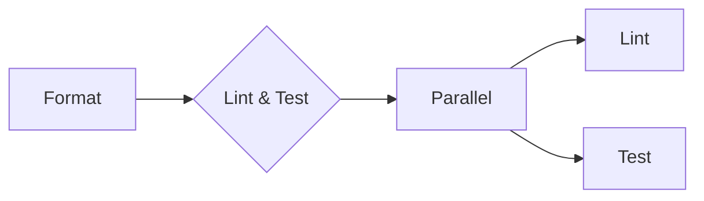

<!--
https://github.com/golangci/golangci-lint/blob/master/docs/src/%40rocketseat/gatsby-theme-docs/src/components/logo.svg
https://github.com/evilmartians/lefthook/blob/master/logo_sign.svg
https://storage.googleapis.com/trufflehog-static-sources/pixel_pig.png
-->

I was introduced to Lefthook as part of [Melbourne's Golang Meet-up of September 2024](https://www.meetup.com/golang-mel/events/301991465/), and I've been postulating if and how I should use Git hooks. After watching Theo's video[^1], I completely agree that CI pipelines should be the primary method of enforcing code quality measures unit tests and linting rules. I do believe that git hooks can come in handy as an **opt-in** tool for running offline secret scanning in some corporate settings where platform features like [GitHub's secret scanning](https://docs.github.com/en/code-security/secret-scanning/introduction/about-secret-scanning) might not be available.

# Pre-requisites
* [`golangci-lint`](https://golangci-lint.run)
* [`lefthook`](https://evilmartians.com/opensource/lefthook)
* [`trufflehog`](https://github.com/trufflesecurity/trufflehog)

# Sequential Processes

```yml
# yaml-language-server: $schema=https://json.schemastore.org/lefthook.json
# https://github.com/evilmartians/lefthook/issues/66#issuecomment-1313279972
pre-commit:
  piped: true
  commands:
    hog:
      run: trufflehog filesystem {staged_files}
```

# Parallel Processes



```yml
# yaml-language-server: $schema=https://json.schemastore.org/lefthook.json
# https://github.com/evilmartians/lefthook/issues/66#issuecomment-1313279972
pre-commit:
  piped: true
  commands:
    fmt:
      glob: "*.go"
      run: gofmt -l -w {staged_files}
      stage_fixed: true
      priority: 1
    lint-test:
      run: LEFTHOOK_QUIET=meta,success lefthook run lint-test
      priority: 2
list-test:
  parallel: true
  commands:
    lint:
      glob: "*.go"
      run: golangci-lint run {staged_files}
    test:
      glob: "*.go"
      run: go test -cpu 24 -race -count=1 -timeout=30s .
    hog:
      run: trufflehog filesystem {staged_files}
```

[^1]: https://youtu.be/LL01pLjcR5s
[^2]: https://gitlab.com/alecthegeek/lefthook-for-docs/-/blob/main/.lefthook.yaml