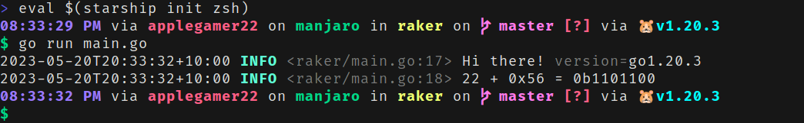
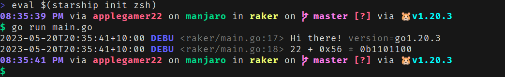
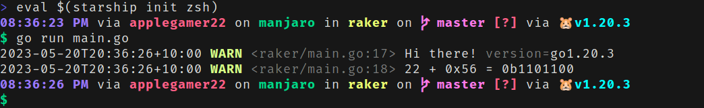
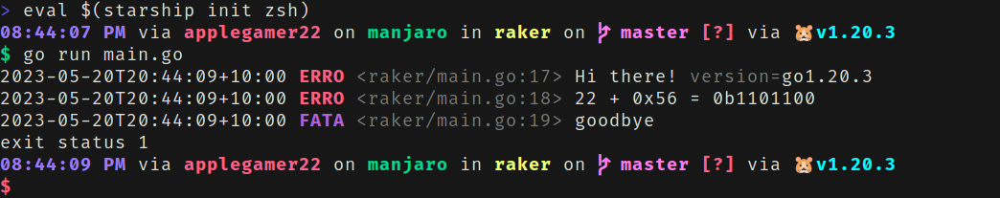

# Why?
Whenever you debug a program that produces a large amount of logs, sifting through them when a bug arises is only a matter of time. This tasks becomes more annoying when there is no consistent pattern you focus on with `grep`, especially when you want to find a pattern between related log lines that aren't immediately next to each other in the log file. When I resort to manually looking through logs of programs I'm debugging, having colour-coded logs tends to make the experience more fun.

 describing the lack of colour in logs")

# How?
I recently found [a logging library](https://pkg.go.dev/github.com/charmbracelet/log) by [Charm](https://charm.sh), a start-up dedicated to making pleasing-to-use libraries, utilities and application that are centered around the command-line experience. Since I never really thought of making my programs' command-line output easy to read, I thought of giving it a try.

## Custom Logger
For my personal project, I override the default package settings with the following:

* Each log line reports what source code line printed it.
* RFC 3339 timestamp format
* In order to show debugging logs by default, the default logging level is be set to `log.DebugLevel`.

```go
import (
	"time"

	"github.com/charmbracelet/log"
)

func init() {
	log.SetReportCaller(true)
	log.SetTimeFormat(time.RFC3339)
	log.SetLevel(log.DebugLevel)
}
```

## Result
In the following section, I'll show some code snippets and the output they produce (captured with [`vhs`](https://github.com/charmbracelet/vhs)).

### Information/Success
Regular logs are shown with a green-coloured `INFO` prefix.

```go
log.Info("Hi there!", "version", runtime.Version())
log.Infof("%d + 0x%x = 0b%b", 22, 0x56, 22+0x56)
```



### Debugging
Debug logs are shown with a blue-coloured `DEBU` prefix.

```go
log.Debug("Hi there!", "version", runtime.Version())
log.Debugf("%d + 0x%x = 0b%b", 22, 0x56, 22+0x56)
```



### Warning
Warning logs are shown with a yellow-coloured `WARN` prefix.

```go
log.Warn("Hi there!", "version", runtime.Version())
log.Warnf("%d + 0x%x = 0b%b", 22, 0x56, 22+0x56)
```



### Error & Fatal
* Error logs are shown with a red-coloured `ERRO` prefix.
* Fatal logs are shown with a purple-coloured `FATA` prefix.
	* Any call to `log.Fatal` or to `log.Fatalf` will result in the program exiting immediately with code 1.

```go
log.Error("Hi there!", "version", runtime.Version())
log.Errorf("%d + 0x%x = 0b%b", 22, 0x56, 22+0x56)
log.Fatal("goodbye")
```



# Using in Other Libraries
## Temporal
The Go SDK for Temporal's durable execution framework allows the developer to [substitute a custom logger](https://docs.temporal.io/dev-guide/go/observability#custom-logger) in order to suit the logging format of any project. Using the SDK's [structured logging support](https://pkg.go.dev/go.temporal.io/sdk/log#NewStructuredLogger), the Charm logger can be used within the [Temporal logging stack](https://docs.temporal.io/dev-guide/go/observability#logging).

```go
import (
	"log/slog"
	"time"

	// ...
	"github.com/charmbracelet/log"
	"go.temporal.io/sdk/client"
	tlog "go.temporal.io/sdk/log"
	"go.temporal.io/sdk/worker"
)

func main() {
	options := client.Options{
		Logger: tlog.NewStructuredLogger(slog.New(log.Default())),
	}
	c, err := client.Dial(options)
	if err != nil {
		log.Fatal("Unable to create client", err)
	}
	defer c.Close()

	w := worker.New(c, "task-queue", worker.Options{})
	// ...

	if err := w.Run(worker.InterruptCh()); err != nil {
		log.Fatal("Unable to start worker", err)
	}
}
```