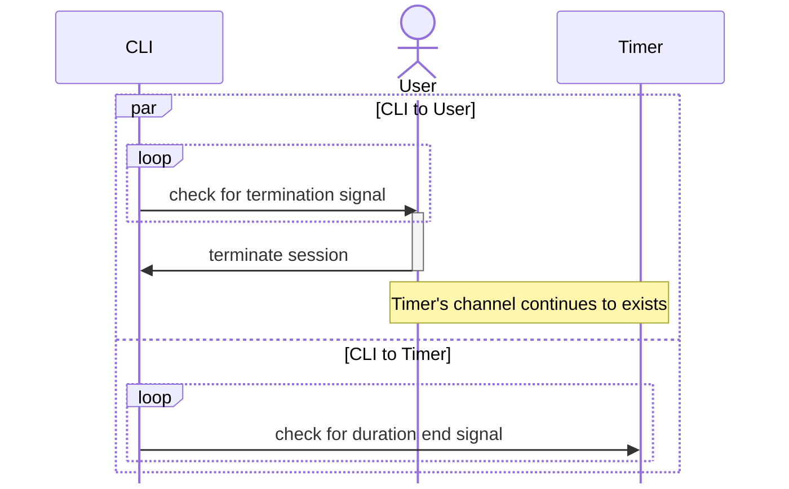

# Background
This problem was found in my command-line interfaced (CLI) screensaver inhibitor project, named [`cocainate`](https://github.com/AppleGamer22/cocainate) and written in Go. The screensaver inhibitor can wait until a termination signal is issued, or wait until for optionally-provided duration. The screensaver inhibitor's session is tracked by constructing a data structure with the specified duration, and a termination signals channel, linked to the process' signal buffer.

```go
s := Session{
	Duration: duration,
	Signals:  make(chan os.Signal, 1),
}
signal.Notify(s.Signals, os.Interrupt, syscall.SIGTERM, syscall.SIGQUIT)
```

The part of the code shown below is how I used to implement the CLI functionality that waits for either:

* a timer (with user-specified duration) to end. This is triggered by a `time.Time` object sent to the channel returned by the `time.After` function, which occurs after the duration specified in the function's input,
* or for the user to manually stop the screensaver inhibitor. This is triggered by a channel that listens for terminations signals sent to the programs by either the operating system, or the user via the command-line shell.

```go
select {
	case <-time.After(s.Duration):
	case <-s.Signals:
}
```

# Potential Channel Leaks
The issue starts when the user terminates the screen inhibitor session before the timer (with the duration specified in the CLI's arguments) ends. According to the documentation of [`time.After`](https://pkg.go.dev/time#After)[^1]:

> [`After`](https://pkg.go.dev/time#After) waits for the duration to elapse and then sends the current time on the returned channel. It is equivalent to `NewTimer(d).C`. The underlying [`Timer`](https://pkg.go.dev/time#Timer) is not recovered by the garbage collector until the timer fires. If efficiency is a concern, use [`NewTimer`](https://pkg.go.dev/time#NewTimer) instead and call [`Timer.Stop`](https://pkg.go.dev/time#Timer.Stop) if the timer is no longer needed.



Therefore, in this case, if the user sends a termination signal, the timer's channel continues to exists in the heap until its duration is over, because it's [not stopped](#background) manually. Over the course of time between the receiving of the termination signal to the end of the timer's duration, the timer's channel is still accessible despite no longer being read by the program, which constitutes a [memory leak](https://en.wikipedia.org/wiki/Memory_leak)[^2], which may lead to performance and reliability issues.

# How I Fixed It
In [this commit](https://github.com/AppleGamer22/cocainate/pull/34/commits/d93f63defa73cc01d245e7db5a1a53e477245742) (shown below), I use a a complete `time.Timer` (as advised by Go's [standard library documentation](#potential-channel-leaks)) object rather than just its channel, which allows me to close it after a termination signal is received, which allows Go's garbage collector to clean it as soon as possible.


```go
timer := time.NewTimer(s.Duration)
select {
	case <-timer.C:
	case <-s.Signals:
		timer.Stop()
}
```

[^1]: Go's `time`'s Module Documentation (<https://pkg.go.dev/time#After>)
[^2]: Memory Leak Wikipedia article (<https://en.wikipedia.org/wiki/Memory_leak>)
