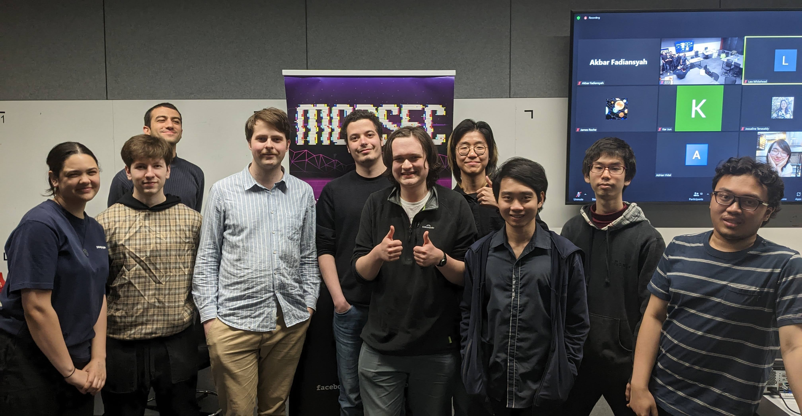
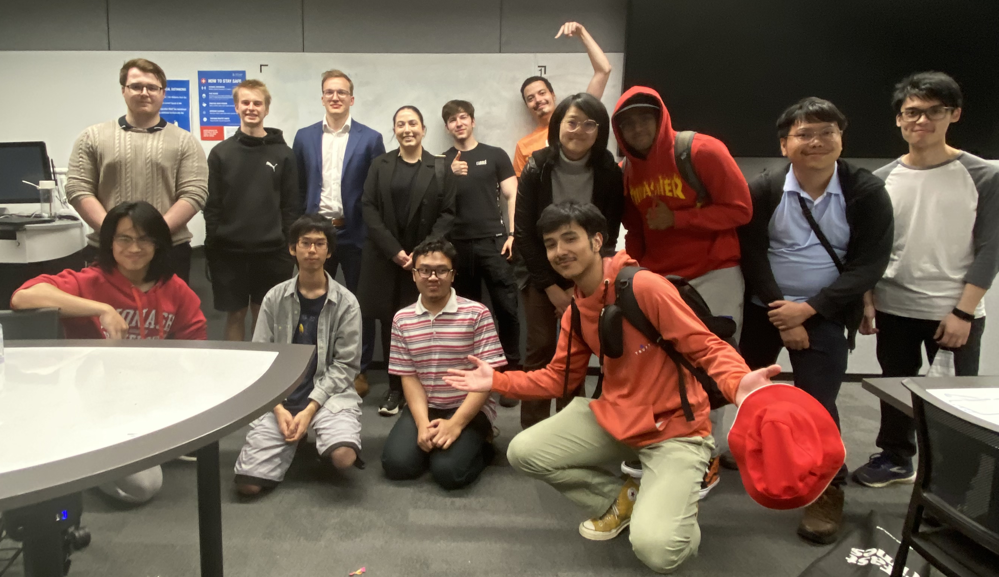
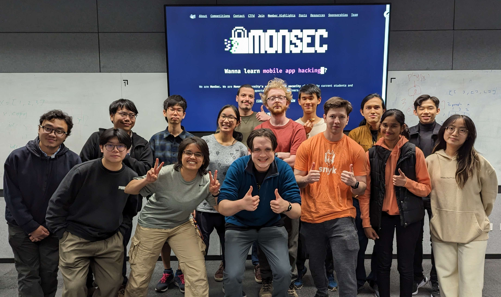
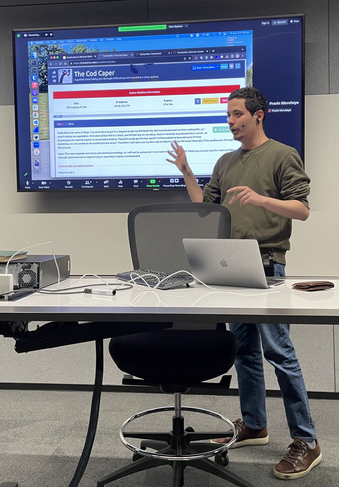

# The Beginning
## Assistant Member Training Officer
## Secretary
## Vice-President

# President
## Preparation
## 2023 Semester 1

## 2023 Semester 2

# Main Takeaways
This post would have been meaningless if I wouldn't have laid out my key lessons from being part of MonSec:

* Keep nurturing a wholesome team culture, **everything else depends on that**.
* Learn from experiences of previous committees (and from yours as well).
* Focus on your club's mission according to its definition.
* Understand and mitigate your skill deficiency over time.
* Engage with the club members as much as possible, and ask them how the club is doing.

I'm sure MonSec will continue being just as or even more of a wholesome group of passionate ethical hackers, and even though I'm no longer involved in its leadership I'll always be happy to help them out where I can.

 appreciates this meme… (made with [GIMP](https://gimp.org))")