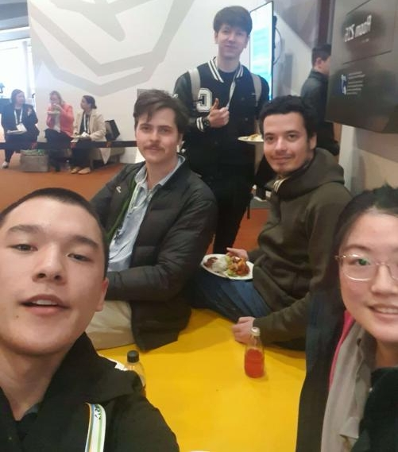

# The Beginning
My first year in university wasn't normal, due to the COVID-19 pandemic I had to adjust to both learning from home and to socialising in a complexly new environment with more restrictive means of interactions. The following year's orientation week, I noticed some familiar names on the cohort's Discord server mentioning they will be representing the cyber-security club at the student association's orientation festival. Since I didn't know anybody else that went to that event, I decided to check their booth out. The first 2 people I met from MonSec were Leo and Luca, who were super-friendly, they asked me of my previous experience and presented me with nifty lock-picking and cryptography challenges. The most memorable part was when Leo asked me of my previous experience, and I jokingly said "~~[I use Arch by the way](https://knowyourmeme.com/memes/btw-i-use-arch)~~" (note to self: that joke went horribly in retrospective).

## Assistant Member Training Officer
It turns out that there were some available positions in the MonSec committee at the beginning of 2021, I was pondering if I should try applying. I asked Leo about it during a Java class we both attended, and he said that I should go for it. In the application form, I wrote a short summary about myself, with [a link to my GitHub](https://github.com/AppleGamer22), in order to showcase my previous experience as evidence to my work ethic. That seemed to make the difference, because after a few weeks, the committee announced that I got accepted, and I asked them why it turns out I was of a few people that included external hyperlinks as evidence to my projects.

## Secretary
## Vice-President

# President
## Preparation
## 2023 Semester 1

## 2023 Semester 2

# Main Takeaways
This post would have been meaningless if I wouldn't have laid out my key lessons from being part of MonSec:

* Keep nurturing a wholesome team culture, **everything else depends on that**.
* Learn from experiences of previous committees (and from yours as well).
* Focus on your club's mission according to its definition.
* Understand and mitigate your skill deficiency over time.
* Engage with the club members as much as possible, and ask them how the club is doing.

I'm sure MonSec will continue being just as or even more of a wholesome group of passionate ethical hackers, and even though I'm no longer involved in its leadership I'll always be happy to help them out where I can.

 appreciates this meme… (made with [GIMP](https://gimp.org))")