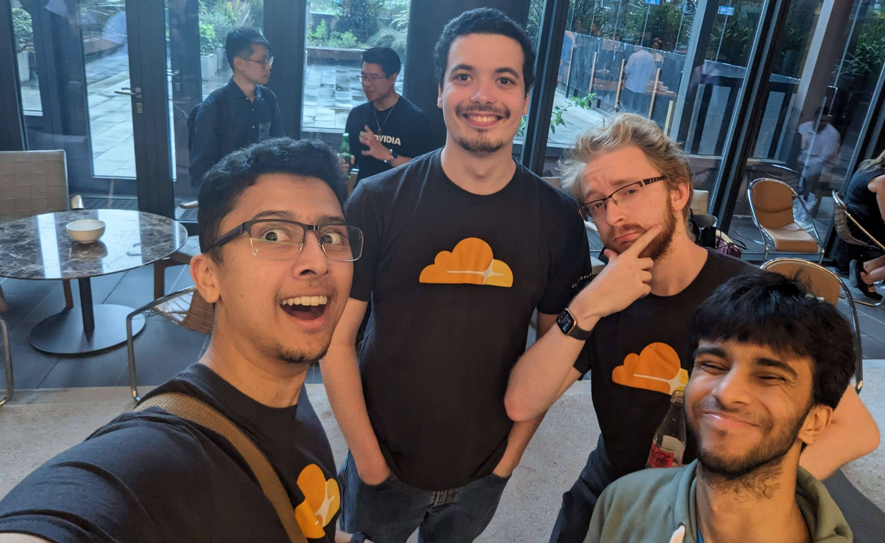

# The Beginning
My first year in university wasn't normal, due to the COVID-19 pandemic I had to adjust to both learning from home and to socialising in a complexly new environment with more restrictive means of interactions. The following year's orientation week, I noticed some familiar names on the cohort's Discord server mentioning they will be representing the cyber-security club at the student association's orientation festival. Since I didn't know anybody else that went to that event, I decided to check their booth out. The first 2 people I met from MonSec were Leo and Luca, who were super-friendly, they asked me of my previous experience and presented me with nifty lock-picking and cryptography challenges. The most memorable part was when Leo asked me of my previous experience, and I jokingly said "~~[I use Arch by the way](https://knowyourmeme.com/memes/btw-i-use-arch)~~" (note to self: that joke went horribly in retrospective).

## Assistant Member Training Officer
It turns out that there were some available positions in the MonSec committee at the beginning of 2021, I was pondering if I should try applying. I asked Leo about it during a Java class we both attended, and he said that I should go for it. In the application form, I wrote a short summary about myself, with [a link to my GitHub](https://github.com/AppleGamer22), in order to showcase my previous experience as evidence to my work ethic. That seemed to make the difference, because after a few weeks, the committee announced that I got accepted, and I asked them why it turns out I was of a few people that included external hyperlinks as evidence to my projects.

During this period of a semester and a bit, I learned about how MonSec works from behind the scenes, ran an online workshop whose demo didn't go as planned (immensely valuable for troubleshooting future workshops). The conversation I remember the most from this period was my introduction to the then-secretary, Luke who told that the MonSec team culture is based on recognising that the MonSec committee members are students, thus being relatively relaxed with deadlines is a requirement. At the time, I didn't understand how critical it was that we made that part of the team culture official from the start of each term, but it made [my presidency](#president) much more enjoyable.

## Secretary
The following year I moved to a more paperwork-heavy and administrative role, that involved record keeping of the committee and general meetings. I found it hard to parallelise the functions of documenting the meeting, and being attentive to what is being said. This struggle lead me to use several methods of documentation, such as a multi-media recording of the meeting, thus diversifying the dependency from one source of truth to multiple. In addition, I saw an opportunity to automate some repetitive routines, mainly the generation of plots for the semi-annual general meeting reports. I wrote a Python script that ingests the membership log of the club, and produces a set of plots for future secretaries to use in their report.

## Vice-President
Towards the end of 2022's first semester, the then-president Peter notified the committee of his intention to resign during the Ordinary General Meeting (OGM). As expected from a relatively-niche club of the size we where at the time, it wasn't a guarantee that we could fill the vacancy by having someone new (to the committee) putting their name on the ballot for such a senior role. In order to keep MonSec running, we had to step up and be ready to accept a role with more responsibility, and teach what we learned to the person that replaces us in the previous role. After more than a year later, it's safe to say that the MonSec team showed their versatility as most of the committee had to learn and perform a new role at the same time with far less preparation time. It should also be noted that this versatility positively impacted the committee transition to [2023](#president).

This role was an amazing preparation to the next year, as I got to talk to academic and industry stakeholders such as researchers, university staff, sponsors and partners and plan future engagements with them.

# President
Before Peter's role ended, he handled the paperwork required to register MonSec as a [non-profit organisation](https://www.acnc.gov.au/charity/charities/5e6985b5-f1e2-ec11-bb3e-002248116a15/profile), which intended to be used for discounted digital infrastructure. Initially, we intended to focus on transitioning our CTFd server to Microsoft Azure, since they offer a non-profit grant that will be substantially cheaper for us. Our systems administrator Matti, did a tremendous work learning [Infrastructure as Code](https://developer.hashicorp.com/terraform/tutorials/aws-get-started/infrastructure-as-code) in order to have our Azure resources documented. His work enabled the next system administrator, Kar Jun to up-skill himself, and it also gave me an excuse to learn [Terraform](https://terraform.io) as well.

With the 2023 committee assembled, I had some plans to make the club's mission reach more people through improved social media.

## Preparation
We started by planning the events we will have during semester 1, which included our weekly workshops and the promotional activities during the orientation festival. Since I haven't worked extensively with most of the team beforehand, I got to know them and their goals for the club and their roles throughout the summer break. I wanted to be sure that all of the team members understand their part in the club's mission and the time commitment the team members can expect from each other. I felt this was important to define since the team is composed of university students, thus making it unrealistic to expect the same level of commitment of everyone regardless of their individual circumstances.

## 2023 Semester 1
We started the semester 1[^1] at the orientation stall, where the team introduced MonSec to new students, with goal of getting Monash University students to attend our weekly workshops.

We used the classic analogy of lock-picking to explain the philosophy of hacking to new MonSec members. This method has been demonstrated in every orientation festival to be very effective in attracting curious students to attend our events.

## 2023 Semester 2
[^2]

# The Future

# Credits
This journey has not been possible without my teammates and friends that made this experience one of the highlights of my degree.

* Leo has been instrumental in shaping how MonSec runs its technical workshops, which is evident by the unique taste and style of the educational content he produced.
* Peter was immensely helpful in registering MonSec as a not-for-profit organisation, along with providing the committee with meaningful guidance.
* Emily, Luke, James and Luca were crucial in showing how to be a productive team member in a stressful time such as in during the COVID-19 pandemic.
* Akbar has been instrumental in maintaining our media pipeline and our website, along with being a diligent secretary.
* Matti was the cornerstone of MonSec's cloud migration effort, which is safe to say he nailed. In addition he taught me a lot regarding server administration throughout his time with MonSec.
* Yuki
* Sean
* Jamie
* Elias
* Kar Jun
* Preeti
* Sarah
* Oscar
* Rahul and Chloe
* Rohan has been the bridge between the Faculty of Information Technology's student engagement operations and MonSec, and he made these discussions a breeze.

# Main Takeaways
This post would have been meaningless if I wouldn't have laid out my key lessons from being part of MonSec:

* Keep nurturing a wholesome team culture, **everything else depends on that**.
* Learn from experiences of previous committees (and from yours as well).
* Focus on your club's mission according to its definition.
* Understand and mitigate your skill deficiency over time.
* Engage with the club members as much as possible, and ask them how the club is doing.

I'm sure MonSec will continue being just as or even more of a wholesome group of passionate ethical hackers, and even though I'm no longer involved in its leadership I'll always be happy to help them out where I can.

 appreciates this meme… (made with [GIMP](https://gimp.org))")

[^1]: Bornstein, O. (2023, February 19). 2023 Semester 1. Monash Cyber Security Club. <https://monsec.io/posts/2023s1/>
[^2]: Bornstein, O. (2023, July 19). 2023 Semester 2. Monash Cyber Security Club. <https://monsec.io/posts/2023s2/>