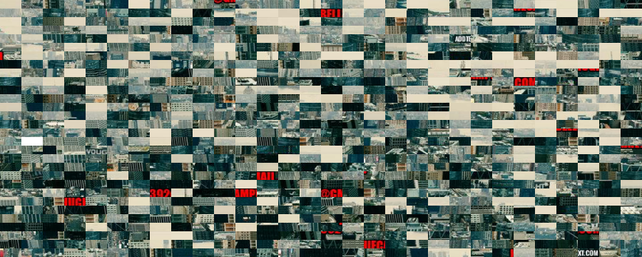

# Prompt
> The new Head of Crime Analytics is named - The Deep. The Deep addresses the Crime team and Cassandra brings cupcakes for the team. They fired most of the staff because of past tweets that were critical of Homelander. Homelander as paranoid as ever believes that the boys has yet another plan to take down Vought International. As one of the members from the few left behind it is upon your shoulders to crack down on the boys' plan to take down Vought by looking into the suspicious GitHub user who goes by the name `sk1nnywh1t3k1d` or face Homelander's wrath.

# Solution
## GitHub
1. The GitHub profile can be found at <https://github.com/sk1nnywh1t3k1d>
1. This GitHub user has only one repository with only 2 commits
	* <https://github.com/sk1nnywh1t3k1d/chat-app>
1. The first commit added a file named `chat.txt` that was deleted on the second commit
	* <https://github.com/sk1nnywh1t3k1d/chat-app/commit/d830e9b9a9cd531b2677bad94b4a08d7a539738b#diff-d341c91ed9aff89bf6ea2d5fa7b245307f745a1e9374328e47c79f1529be627a>
	* The commit also has author's the email (`hughiecampbell392@gmail.com`) if viewing the [patch](https://github.com/sk1nnywh1t3k1d/chat-app/commit/d830e9b9a9cd531b2677bad94b4a08d7a539738b.patch).
1. The `chat.txt` file mention the shortened URL <https://bit.ly/voughtencrypted>


## WAV
1. The previously-mentioned shortened URL leads to an audio file download:
	<audio src="./secret_message.wav" controls></audio>
1. When the audio file is shown in [Audacity's Spectrogram](https://manual.audacityteam.org/man/audacity_waveform.html#multi), the following text (`thguovdne hsals drawrof yl tod tib`) can be seen:
	
1. By reversing the message the shortened URL (<https://bit.ly/endvought>) can be read:

	```sh
	$ echo "thguovdne hsals drawrof yl tod tib" | rev
	bit dot ly forward slash endvought
	```

## PNG
1. The previously-mentioned shortened URL leads to an image file download:
	