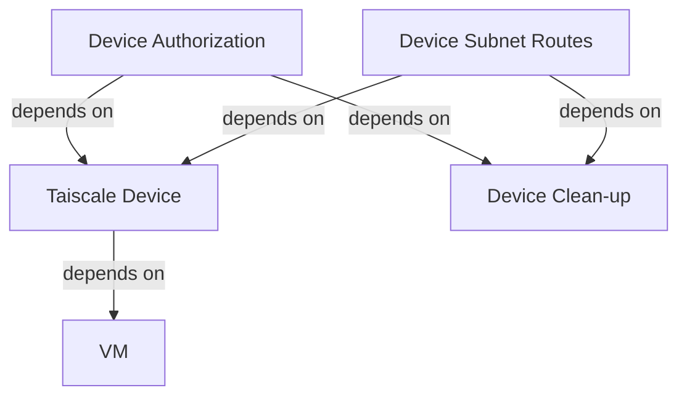

Here is my config for the Tailscale resources:

```tf
data "tailscale_device" "azVM" {
  hostname   = azurerm_linux_virtual_machine.azVM.computer_name
  wait_for   = "120s"
  depends_on = [azurerm_linux_virtual_machine.azVM]
}

resource "tailscale_device_authorization" "azVM" {
  device_id  = data.tailscale_device.azVM.node_id
  authorized = true
  depends_on = [terraform_data.tailscale_device_cleanup]
}

resource "tailscale_device_subnet_routes" "azVM" {
  device_id  = data.tailscale_device.azVM.node_id
  depends_on = [terraform_data.tailscale_device_cleanup]
  routes = [
    "10.1.0.0/24",
    "168.63.129.16/32",
  ]
}

resource "terraform_data" "tailscale_device_cleanup" {
  input = {
    device_id         = data.tailscale_device.azVM.id
    tailscale_api_key = var.tailscale_api_key
  }
  provisioner "local-exec" {
    when       = destroy
    on_failure = continue
    command = "curl 'https://api.tailscale.com/api/v2/device/${self.input.device_id}' --request DELETE --header 'Authorization: Bearer ${self.input.tailscale_api_key}'"
  }
}
```