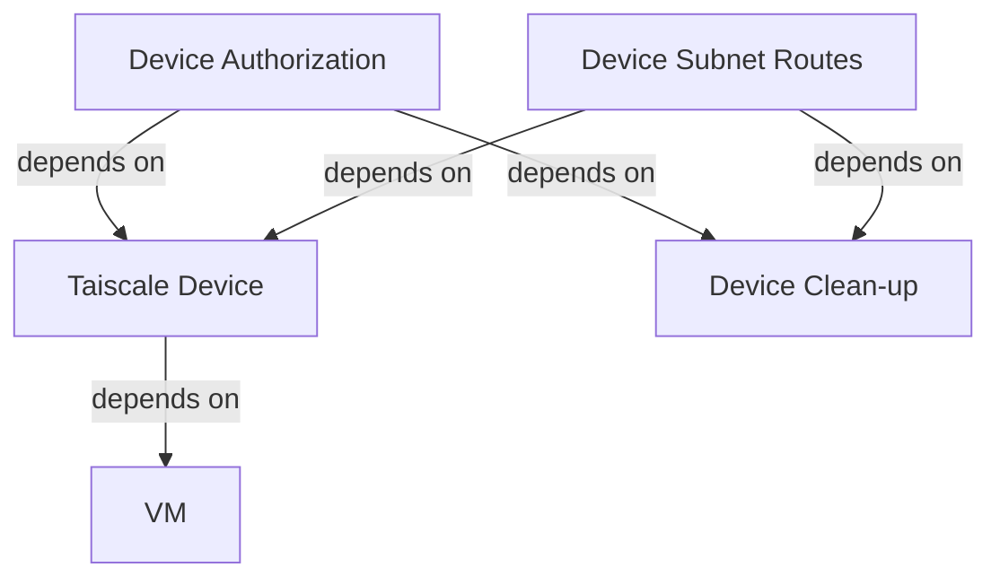

I've been looking for an Infrastructure as Code (IaC) use case for my personal life, and I've recently found one that delivers both utility and cost-effectiveness: provisioning and connecting VPN servers into my [tailnet](https://tailscale.com) seamlessly. In this post, I'll be be adding on top of other approaches [^1] [^2] with a fix I incorporated for an [issue](https://github.com/tailscale/terraform-provider-tailscale/issues/68) with [Tailscale's Terraform provider](https://registry.terraform.io/providers/tailscale/tailscale/latest/docs).

<details>
<summary>This meme has the same energy as this post:</summary>

")

</details>

# Pre-requisites
Before you get started, you'll need the following:

* A Tailscale account
* An account with a cloud provider
* A working [OpenTofu](https://opentofu.org)/[Terraform](https://developer.hashicorp.com/terraform) deployment pipeline for a compute instance compatible with [cloud-init](https://cloud-init.io).

# Provisioning a Key
Tailscale requires automatic device deployments to provide an authentication key when they join the tailnet, which can be easily provisioned and reused by the rest of the Terraform resources.

```tf
provider "tailscale" {
	api_key = var.tailscale_api_key
	tailnet = var.tailnet_name
}

resource "tailscale_tailnet_key" "tailscale_key" {
	reusable      = true
	ephemeral     = false
	preauthorized = true
	tags          = ["tag:vpn"]
	expiry        = 7776000
	description   = "IaC Tailscale key for 90 days"
}

output "tailnet_key" {
	value       = tailscale_tailnet_key.tailscale_key.key
	sensitive   = true
	depends_on  = [tailscale_tailnet_key.tailscale_key]
	description = "IaC Tailnet Key"
}
```

Devices that join the tailnet with this key will automatically be included in the access controls [grants](#grants-for-tagged-devices--users) defined by the `vpn` tag and any other tags included.

## Grants for Tagged Devices & Users
The grants for users and devices assigned to the `vpn` tag can be defined as follows:

```jsonc
{
	"tagOwners": {
		"tag:vpn": ["autogroup:admin"],
	},
	"grants": [
		// ...
		{
			"src": ["autogroup:admin"],
			"dst": ["*"],
			"ip": ["*"],
		},
		{
			"src": ["group:vpn"],
			"dst": ["autogroup:internet"],
			"ip": ["*"],
			"via": ["tag:vpn"],
		},
	],
	// ..
}
```

Such configuration allows users in the `vpn` group (as defined by the tailnet's administrator) to use devices in the same group as exit nodes.

# Automatic Device Enrolment
Once a fresh VM is booted, it will need to know how to connect to the tailnet. Tailscale provides a cloud-init[^3] configuration that can be added to most cloud providers' compute instances in order to automatically connect a compute instance to a tailnet.

```yml
#cloud-config
# yaml-language-server: $schema=https://raw.githubusercontent.com/canonical/cloud-init/main/cloudinit/config/schemas/versions.schema.cloud-config.json
runcmd:
	- curl -fsSL https://tailscale.com/install.sh | sh
	- ['sh', '-c', "echo 'net.ipv4.ip_forward = 1' | sudo tee -a /etc/sysctl.d/99-tailscale.conf && echo 'net.ipv6.conf.all.forwarding = 1' | sudo tee -a /etc/sysctl.d/99-tailscale.conf && sudo sysctl -p /etc/sysctl.d/99-tailscale.conf" ]
	- tailscale up --advertise-exit-node --ssh --accept-routes --advertise-routes=${routes} --accept-dns=${accept_dns} --authkey=${tailscale_auth_key}
```

This file can be used by OpenTofu/Terraform[^4] to fill-in the automatically-provisioned tailnet key.

```tf

data "template_cloudinit_config" "config" {
	gzip          = true
	base64_encode = true
	part {
		content_type = "text/cloud-config"
		content = templatefile("${path.module}/../../cloud_init.yml", {
			tailscale_auth_key = module.ts.tailnet_key
			routes             = "10.1.0.0/24,168.63.129.16/32"
			accept_dns         = false
		})
	}
}
```

# Authorising The Device
Tailscale Terraform provider can reference the device through it's [`tailscale_device` resource](https://registry.terraform.io/providers/tailscale/tailscale/latest/docs/data-sources/device). In this example it depends on an Azure Linux VM, but this can be changed for any other cloud provider's OpenTofu/Terraform compute resource that accepts a [cloud-init configuration](#automatic-device-enrolment) similar to the one mentioned above.

```tf
data "tailscale_device" "azVM" {
	hostname = azurerm_linux_virtual_machine.azVM.computer_name
	wait_for = "120s"
}
```

The `tailscale_device` resource waits for 2 minutes for the VM to boot (counting from its provisioning time), run the script in its cloud-init configuration and join the tailnet. This resource can be used to declaratively pre-authorise the device into the tailnet and define it's routes.

```tf
resource "tailscale_device_authorization" "azVM" {
	device_id  = data.tailscale_device.azVM.node_id
	authorized = true
}

resource "tailscale_device_subnet_routes" "azVM" {
	device_id = data.tailscale_device.azVM.node_id
	routes = [
		"10.1.0.0/24",
		"168.63.129.16/32",
		# Configure as an exit node
		"0.0.0.0/0",
		"::/0",
	]
}
```

Af this stage the automatically-provisioned VM is acting is a regular exit node in the tailnet that is accessible by any user with the `vpn` tag.

# Decommissioning The Device On-Demand
OpenTofu/Terraform can run external commands in order to fill the gaps that a given provider hasn't yet addressed, but these capability should be used as [**a last resort**](https://opentofu.org/docs/language/resources/provisioners/syntax/#provisioners-are-a-last-resort). By using a provisioner that is run on `tofu destroy`, the [Tailscale API](https://tailscale.com/api#tag/devices/delete/device/{deviceId}) is invoked directly in order to remove the decommissioned device off the tailnet.

```tf
resource "terraform_data" "tailscale_device_cleanup" {
	input = {
		device_id         = data.tailscale_device.azVM.id
		tailscale_api_key = var.tailscale_api_key
	}
	provisioner "local-exec" {
		when       = destroy
		# in case the device has been removed manually
		on_failure = continue
		command = <<EOT
			curl 'https://api.tailscale.com/api/v2/device/${self.input.device_id}' \
				--request DELETE \
				--header 'Authorization: Bearer ${self.input.tailscale_api_key}'
		EOT
	}
}
```

However, using this provisioner by itself gives OpenTofu/Terraform no knowledge of the dependency graph. This was demonstrated on the first time I tried to run `tofu destroy`, after which I expected the Tailscale device entry for the VM to be cleanly removed alongside the rest of the `tailscale_device_authorization` and `tailscale_device_subnet_routes` resources. However, the provisioner for `terraform_data.tailscale_device_cleanup` was run as soon as possible, which happened to be before the above-mentioned resources were decommissioned cleanly. This sloppy order of execution prevented the clean continuation for the rest of the pipeline.

Luckily there is an easy fix.

## Correcting The Resource Dependency Graph
This issue stems from the fact that Tailscale's Terraform provider doesn't track the decommissioning of the `tailscale_device` resource (currently being discussed on [GitHub](https://github.com/tailscale/terraform-provider-tailscale/issues/68)), which means I had to implement a similar behaviour on my own. When additional resources are derived from the device's data resource, the device's destroy-time provisioner need to have a similar dependency graph in order to ensure it runs after all of the device's derived resources are destroyed.



These additional dependencies can be defined declaratively by adding `terraform_data.tailscale_device_cleanup` to the `depends_on` attribute of `tailscale_device_authorization` and `tailscale_device_subnet_routes`.

```tf
resource "tailscale_device_authorization" "azVM" {
	device_id  = data.tailscale_device.azVM.node_id
	depends_on = [terraform_data.tailscale_device_cleanup]
	authorized = true
}

resource "tailscale_device_subnet_routes" "azVM" {
	device_id  = data.tailscale_device.azVM.node_id
	depends_on = [terraform_data.tailscale_device_cleanup]
	routes = [
		"10.1.0.0/24",
		"168.63.129.16/32",
		# Configure as an exit node
		"0.0.0.0/0",
		"::/0",
	]
}
```

With these small modifications, cloud-hosted VMs can be added to the tailnet seamlessly with ACL tags and routing authorisations pre-defined, and be decommissioned just as easily.

[^1]: <https://hsps.in/post/setup-on-demand-tailscale-exit-node-using-terraform-and-digital-ocean/>
[^2]: <https://rossedman.io/blog/computers/scale-homelab-with-tailscale/>
[^3]: <https://tailscale.com/kb/1293/cloud-init>
[^4]: <https://www.phillipsj.net/posts/cloud-init-with-terraform/>