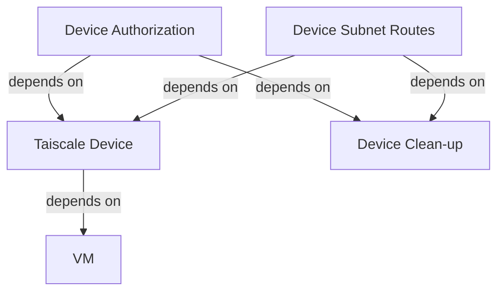

# Automatic Device Enrolment
```yml
#cloud-config
# yaml-language-server: $schema=https://raw.githubusercontent.com/canonical/cloud-init/main/cloudinit/config/schemas/versions.schema.cloud-config.json
runcmd:
  - curl -fsSL https://tailscale.com/install.sh | sh
  - ['sh', '-c', "echo 'net.ipv4.ip_forward = 1' | sudo tee -a /etc/sysctl.d/99-tailscale.conf && echo 'net.ipv6.conf.all.forwarding = 1' | sudo tee -a /etc/sysctl.d/99-tailscale.conf && sudo sysctl -p /etc/sysctl.d/99-tailscale.conf" ]
  - tailscale up --advertise-exit-node --ssh --accept-routes --advertise-routes=${routes} --accept-dns=${accept_dns} --authkey=${tailscale_auth_key}
```

```tf
data "tailscale_device" "azVM" {
  hostname   = azurerm_linux_virtual_machine.azVM.computer_name
  wait_for   = "120s"
  depends_on = [azurerm_linux_virtual_machine.azVM]
}
```

```tf
resource "tailscale_device_authorization" "azVM" {
  device_id  = data.tailscale_device.azVM.node_id
  authorized = true
}

resource "tailscale_device_subnet_routes" "azVM" {
  device_id = data.tailscale_device.azVM.node_id
  routes = [
    "10.1.0.0/24",
    "168.63.129.16/32",
    # Configure as an exit node
    "0.0.0.0/0",
    "::/0",
  ]
}
```

Since I wanted to automatically have the device authorized and ready with routes, the order of destruction for these resources need to align with the device's state in Tailscale's API. When additional resources are derived from the device's data resource, the device's destory-time provisioner need to have a similar dependency graph in order to ensure it runs after all of the device's derived resources are destroyed.



Here is my config for the Tailscale resources:

```tf
resource "tailscale_device_authorization" "azVM" {
  device_id  = data.tailscale_device.azVM.node_id
  depends_on = [terraform_data.tailscale_device_cleanup]
  authorized = true
}

resource "tailscale_device_subnet_routes" "azVM" {
  device_id  = data.tailscale_device.azVM.node_id
  depends_on = [terraform_data.tailscale_device_cleanup]
  routes = [
    "10.1.0.0/24",
    "168.63.129.16/32",
    # Configure as an exit node
    "0.0.0.0/0",
    "::/0",
  ]
}

resource "terraform_data" "tailscale_device_cleanup" {
  input = {
    device_id         = data.tailscale_device.azVM.id
    tailscale_api_key = var.tailscale_api_key
  }
  provisioner "local-exec" {
    when       = destroy
    on_failure = continue
    command = "curl 'https://api.tailscale.com/api/v2/device/${self.input.device_id}' --request DELETE --header 'Authorization: Bearer ${self.input.tailscale_api_key}'"
  }
}
```